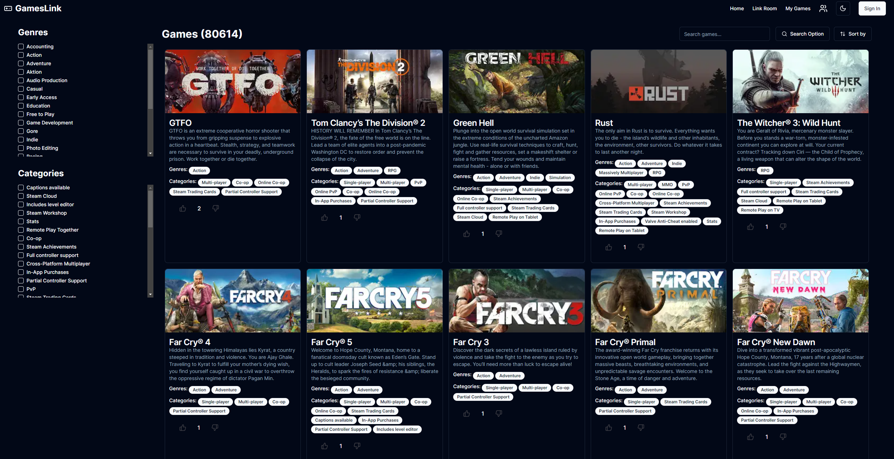

> Follow me on twitter [@yousof_dev](https://twitter.com/yousof_dev) for updates.

## Planned Features

-   Better similar algorithm and recommendation algorithm.
-   More user customization and allow ability to reset recommendation algorithm.
-   Allow site to work on multiple languages and get region specific games.

## Purpose

All gamers have had that moment when they are sitting around saying "what game should we play". The steam layout does not help, the recommendation engine is not great, and it's hard to find new games.

GamesLink solves this problem using a fresh layout and A.I. powered features.
